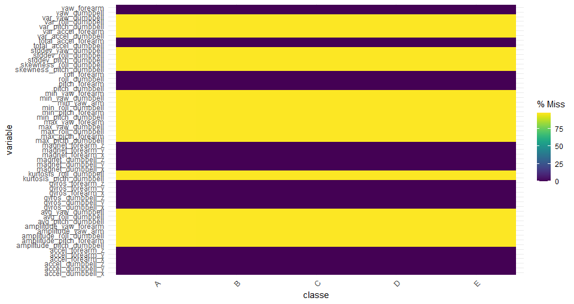
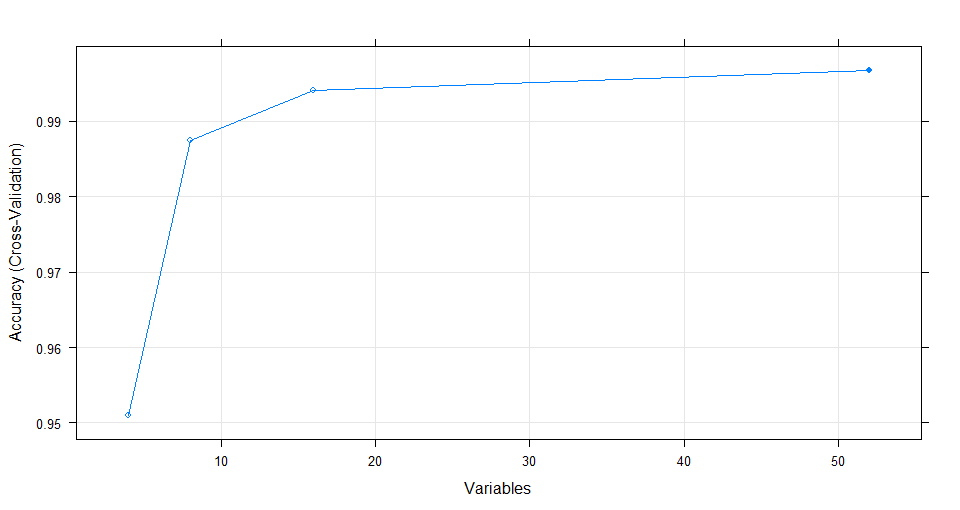

# **Coursera Practical Machine Learning project**

One thing that people regularly do is quantify *how much* of a particular activity they do, but they rarely quantify *how well* they do it. In this project, we used data consisting of measurements from accelerometers on the belt, forearm, arm, and dumbell of 6 participants.  

The goal of this project was to predict the manner in which the participants did the exercise.   

Outputs of the `R` code in this document were not evaluated due to some security concerns regarding the data.

## **Data**  
Data for this project come from http://web.archive.org/web/20161224072740/http:/groupware.les.inf.puc-rio.br/har.  
Six young health participants were asked to perform one set of 10 repetitions of the Unilateral Dumbbell Biceps Curl in five different fashions: exactly according to the specification *(Class A)*, throwing the elbows to the front *(Class B)*, lifting the dumbbell only halfway *(Class C)*, lowering the dumbbell only halfway *(Class D)* and throwing the hips to the front *(Class E)*. *Class A* corresponds to the specified execution of the exercise, while the other 4 classes correspond to common mistakes.

The training dataset consists of 19622 observations of 160 variables. Measurements were taken on participants' arms, forearms, belts and on the dumbbell. Variables in the dataset include three-axes acceleration, gyroscope and magnetometer data, along with their means, variances, amplitudes and other statistics. 

### **Splitting data**  
Data for this project is already splitted into training and testing datasets. As mentioned above, the training set contains 19622 observations (this accounts for 99.89% of the whole sample). The testing set only contains 20 observations. However, we will still be using some of the training data for validation, which will be further described in *cross-validation* section.

## **Exploratory analysis**  

### **Cleaning data and pre-processing**  
We are going to use several functions from the `tidyverse, caret` and `naniar` packages, so we need to load the libraries first

```{r prep1, eval=FALSE}
# load packages needed for this assignment
library(tidyverse)
library(caret)
library(naniar)
```

Both the training and the testing datasest need to be pre-processed in the same way so that our predictions are valid and make sense. We can first have a look at the structure of the data and some summary statistics 

```{r prep2, eval=FALSE}
str(training) # the dplyr package included in tidyverse provides a prettier and more structured output than the base function str()
summary(training)

dim(training)
dim(testing)

names(training)
names(testing) # the testing set doesn't include the classe variable

```
We can see that the `classe` variable is of class character. We need to convert it to class factor, so that it can be handled as a categorical variable.

```{r prep3, eval=FALSE}
training$classe <- factor(training$classe)
```

#### **Removing variables with zero or near-zero variance**  
Now we remove the variables that have a near-zero variance. This is done to avoid bias in our predictions due to almost all observation having the same value of a variable, or all observations belonging to the same group (variables like this are not informative for our purposes).  

```{r prep4, eval=FALSE}
nzv <- nearZeroVar(training, saveMetrics = TRUE)
zerovars <- which(nzv$zeroVar == TRUE | nzv$nzv == TRUE)
training <- training[, -zerovars]
```

We also have 5 variables containing information about timestamps, windows and user names, which don't provide any necessary information, so we are also going to discard those.

```{r prep5, eval=FALSE}
training <- training[, -(1:5)]
```

#### **Dealing with NA values**
From the `summary` function on training data, we saw that some of the variables contain a significant amount of missing values. This missingness appeared to follow a pattern considering the number of missing values and the variables that contain them. To better see this, we can plot the missing values (although we have to do this in 2 separate plots due to still having high amount of variables, but we'll show only one of them).

```{r prep6, eval=FALSE}
gg_miss_fct(x = training[,c(1:55, 113)], fct = classe)
gg_miss_fct(x = training[,c(56:113)], fct = classe)
```


From this we can clearly see the pattern of the missing values. All of the descriptive statistics variables (mean, std, skewness,..) contain only missing values. This means, that these variables are useless to us and we need to remove them.

```{r prep7, eval=FALSE}
missing_inds <- c(grep("^max", names(training)),
                  grep("^min", names(training)),
                  grep("^var", names(training)),
                  grep("^stddev", names(training)),
                  grep("^avg", names(training)),
                  grep("^amplitude", names(training)),
                  grep("^kurtosis", names(training)),
                  grep("^skewness", names(training)))

training <- training[,-missing_inds]
```

#### **Recursive feature elimination**
There's still a lot of remaining predictors. So as a next step, we are going to choose the best predictors via recursive feature elimination. This can be easily done in `R` with the function `rfe()` from the `caret` package. 

```{r prep8, eval=FALSE}
control <- rfeControl(functions = rfFuncs, method = "cv", number = 10)
# run the RFE algorithm
results <- rfe(training[,-53], training$classe, rfeControl = control)
# summarize the results
print(results)
# list the chosen features
predictors(results)
plot(results, type = c("g", "o"))
```


According to this plot, we choose the 18 best predictors (after the 18th predictor, the accuracy doesn't increase very significantly).

```{r prep9, eval=FALSE}
predictors <- predictors(results)[1:18]
training <- training[,c("classe", predictors)]
testing <- testing[,which(names(testing) %in% names(training))]
```

Predictors chosen for the model are: *"roll_belt", "yaw_belt", "magnet_dumbbell_z", "pitch_belt", "magnet_dumbbell_y", "pitch_forearm", "accel_dumbbell_y", "roll_forearm", "magnet_forearm_z", "roll_dumbbell", "roll_arm", "magnet_dumbbell_x", "accel_dumbbell_z", "gyros_belt_z", "magnet_belt_z", "gyros_arm_y", "magnet_belt_y" and "accel_forearm_x".*  

#### **Centering and scaling**  
Now we are going to center and scale both the training and testing data set.

```{r prep10, eval=FALSE}
preproc <- preProcess(training[,-19], method = c("center", "scale"))
train_data <- predict(preproc, training[,-19])
train_data$classe <- training$classe
test_data <- predict(preproc, testing)
```

## **Cross-validation and models**
Let's now try out and compare 3 models. First two will be random forest models, one with using 3-fold cross-validation and one with 10-fold cross-validation. The third will be a boosting model.

```{r models, eval=FALSE}
set.seed(1534)
train_control10 <- trainControl(method = "cv", number = 10)
train_control3 <- trainControl(method = "cv", number = 3)

# random forest prediction method
model10 <- train(classe ~., data = train_data, trControl = train_control10, method = "rf")

model3 <- train(classe ~., data = train_data, trControl = train_control3, method = "rf")

# boosting
model_boost <- train(classe ~., data = train_data, method = "gbm", verbose = FALSE)
```

### **In-sample error**
```{r insample, eval=FALSE}
confusionMatrix(model10) #99% accuracy
confusionMatrix(model3) #96% accuracy
confusionMatrix(model_boost) #86% accuracy
```

## **Prediction**  
The random forest model with 10-fold cross-validation provides the highest accuracy, more than 99%, but takes a very long time to compute. The boosting model is even more computationally demanding and provides less accuracy than both the 3-fold and 10-fold cross-validation random forest models (around 86%). For this prediction, we are going to use the 10-fold model, however, the difference between the 3 and 10 folds is not big when talking about accuracy, but significant when talking about computing time. 

```{r pred, eval=FALSE}
prediction <- predict(model10, newdata = test_data)
test_data$classe <- prediction
```

## **Resources**  
*Velloso, E.; Bulling, A.; Gellersen, H.; Ugulino, W.; Fuks, H. **Qualitative Activity Recognition of Weight Lifting Exercises**. Proceedings of 4th International Conference in Cooperation with SIGCHI (Augmented Human '13) . Stuttgart, Germany: ACM SIGCHI, 2013.*  
Read more: http:/groupware.les.inf.puc-rio.br/har#ixzz4TjqfqEWx
